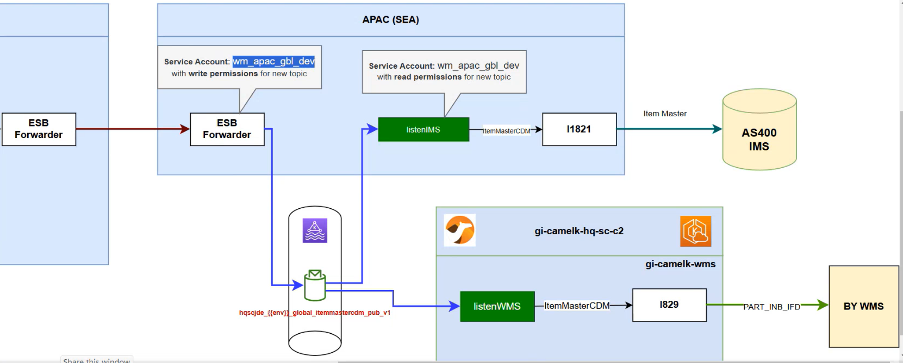

Here, we need to focus on the region assigned to us, which is APAC (SEA). Therefore, we will work with APAC. The topic name is provided in the ESB forwarder, along with the listener listenIMS. This means that if the topic is not already available, we need to create it. We must also follow the specified taxonomy and naming conventions, as outlined below:

```
hqscjde_{{env}}_global_itemmastercdm_pub_v1

<app>_<env>_<global>_<canonical/event>_<pattern>_<ver>
```

Before proceeding, we need to check two things.

First, we need to verify whether the schema is available. To do this, go to the **integration-artifacts** repository and search for **itemMasterCDM**. If it is present, it means the schema is already registered, and there’s no need to create it.

Second, we need to verify whether the application is registered. For this, navigate to the **gi-confluent-kafka-config** repository and check if the **hqscjde** application is available.

Next, we need to create a listener that will listen to the Producer. To do this, we must ensure the correct access is provided, and your service account name, as shown in the diagram above, is wm_apac_gbl_dev.

Now, we need to ensure the correct access rights are granted for the **hqscjde** topic. Before doing so, we should check whether the access is already granted or if it needs to be added. To verify this, search for the topic in the **gi-confluent-kafka-config** repository.

Similarly, we need to check if we have write access to the same topic. If not, we will need to grant the appropriate write access.

Since we are only working on the **APAC** region, we need to focus only on the listener **listenIMS**. The other listener, listenWMS, is managed by the Camel bundle.

To ensure the listener is available, we need to check its presence. For this, go to **wm-platform-config/env_apacdev/group_vars/\_wm_art/wmart_listeners** and verify if **listenIMS** is listed. If it is already present, we will reuse the same listener and simply add our configuration.

---

### cainiaowms ( Local - Singapore ) --> APAC ( Publish ) --> shipconfirmation events --> Global ( Consume ) --> OEBS ( Global Application )

- **cainiaowms_pd_global_shipconfirmcdm_pub_v1**

### Step1:- adding the schema

- **repo: [Integration-artifcats](https://github.com/AmwayCommon/integration-artifacts/blob/main/abgcdm/protobuf/ABGCDM_ShipConfirm_CDM_ShipConfirmCDM.proto)**

### Step2:- Record registration in kafka

- **repo: [gi-confluent-kafka-config](https://github.com/AmwayCommon/gi-confluent-kafka-config/blob/main/records/ABGCDM_ShipConfirm_CDM_ShipConfirmCDM.yml)**

### Step3:- Register an application

- **repo: [gi-confluent-kafka-config](https://github.com/AmwayCommon/gi-confluent-kafka-config/blob/main/applications/cainiaowms.yml)**

### Step4:- Creating a topic

- **repo: [gi-confluent-kafka-config](https://github.com/AmwayCommon/gi-confluent-kafka-config/blob/main/topics/cainiaowms/shipconfirmcdm.yml)**

### Step5:- Defining the topic

- **repo: [gi-confluent-kafka-config](https://github.com/AmwayCommon/gi-confluent-kafka-config/blob/main/env_integration_production/group_vars/_topics/topics_defs/pd.yml)**

### Step6:- Providing the access to consume and publish the data to this topic

- **repo: gi-confluent-kafka-config**
- **[publish permission:](https://github.com/AmwayCommon/gi-confluent-kafka-config/blob/main/env_integration_production/group_vars/_service_accounts/service_accounts/wm_apac_gbl_pd.yml)**

- **[Consume permission:](https://github.com/AmwayCommon/gi-confluent-kafka-config/blob/main/env_integration_production/group_vars/_service_accounts/service_accounts/wm_ent_gbl_pd.yml)**
