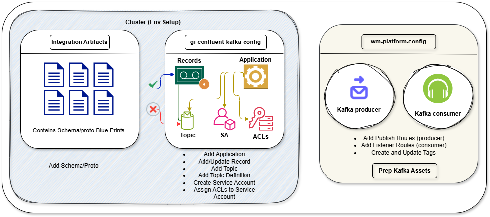

# **UM to Kafka Migration**

## 1. **[integration-artifacts](https://github.com/AmwayCommon/integration-artifacts)** (Contact Canonical Team)

- Add Schema/Proto (Not required if already available) **[Ref](https://github.com/AmwayCommon/integration-artifacts/pull/263/files)**

## 2. **[gi-confluent-kafka-config](https://github.com/AmwayCommon/gi-confluent-kafka-config)**

- Add Application (Not required if already available) **[Ref](https://github.com/AmwayCommon/gi-confluent-kafka-config/tree/main/applications)**
- Add/Update Record (Not required if already available) **[Ref](https://github.com/AmwayCommon/gi-confluent-kafka-config/tree/main/records)**
- Add Topic (include topic configuration) **[Ref](https://github.com/AmwayCommon/gi-confluent-kafka-config/tree/main/topics)**
- Add Topic Definition (for creating the topic) **[Ref](https://github.com/AmwayCommon/gi-confluent-kafka-config/tree/main/env_integration_dev_test/group_vars/_topics/topics_defs)**
- Create Service Account (for native use) **[Ref](https://github.com/AmwayCommon/gi-confluent-kafka-config/blob/main/env_integration_dev_test/group_vars/_service_accounts/service_accounts)**
- Assign ACLs to Service Account (read/write/consume permissions) **[Ref](https://github.com/AmwayCommon/gi-confluent-kafka-config/blob/main/env_integration_dev_test/group_vars/_service_accounts/service_accounts/wm_ent_gbl_dev.yml)**

## 3. **[wm-platform-config](https://github.com/AmwayCommon/wm-platform-config)**

- Add Publish Routes (Check for selector condition) **[Ref](https://github.com/AmwayCommon/wm-platform-config/tree/main/env_entgbldev/group_vars/_amglwmutil/amglwmutil_publish_route)**
- Add Listener Routes (Check for UM trigger filter condition) **[Ref](https://github.com/AmwayCommon/wm-platform-config/tree/main/env_entgbldev/group_vars/_wm_art/wmart_listeners)**
- Create and Update Tags (publisher **[Ref](https://github.com/AmwayCommon/wm-platform-config/blob/main/env_entgbldev/group_vars/amglwmutil.yml)** listener **[Ref](https://github.com/AmwayCommon/wm-platform-config/blob/main/env_entgbldev/group_vars/wm_art.yml)** )

---

## **[integration-artifacts:](https://github.com/AmwayCommon/integration-artifacts)**

To store and manage all the protobuf definitions. To produce or consume message to kafka schema should match, means we need to follow this schema or else the request will reject from the schema registry. So everything is maintained and have added in the integration-artifacts repository. So for enabling we need to check whether our schema is available in integration-artifacts repository or not. If required, we are going to add it, but if any change adding or updating is required, it's not going to be taken care of by the individual developer, But the canonical peoples.

---

## **[gi-confluent-kafka-config:](https://github.com/AmwayCommon/gi-confluent-kafka-config)**

- **Records:** Reocord is nothing but it's a kind of a link or a shortcut or to the `integration artifact`. It contains `record_type` and `schema_type`. This is just a location in the integration artifacts where we are keeping your protobuf files.

- **Application:** For creating topics or service account or ACLs we need first an application. Application is nothing but the application which might going to consume the data or maybe it's going to produce the data. So we need to register application in application folder. Since we are going to migrate UM to Kafka those applications are already registered but if in case it is required then we need to come here and register an application. In application we need to define access also so that later we will use this to provide access.

- **ACLs:** ACLs is used to describe for consumer group read access based on the environment like Dev TS, QA and Prod. Here we need to follow a pattern.

- **Topic:** Beafore creating a topic first we need to register an application and then if an application is already registered then we just need to create a topic.

- **SA (Service Account):** This has required. SO if some applications which wants to consume the data from our topic then we need to registering the applications. It's very rare for this because all the service account already registered. To manage assess level in Kafka toipc level by specifying which environment needs to assess what need to be access. Here need to give read and write access based on which environment is going to publish and which environment is going to subscribe.

---

## **[wm-platform-config](https://github.com/AmwayCommon/wm-platform-config)**

So for the Publish Subscribe before come to this repository we need the schema, we need the topic to be created in Kafka, we need the access to be granted to which topic and from whom. All this should be done prior before come here. Then here in this repository each folder assigned to webMethods environment, and Here we need to define what needs to be done what needs to be deployed. Nothing but this repository is used to manage listeners.
