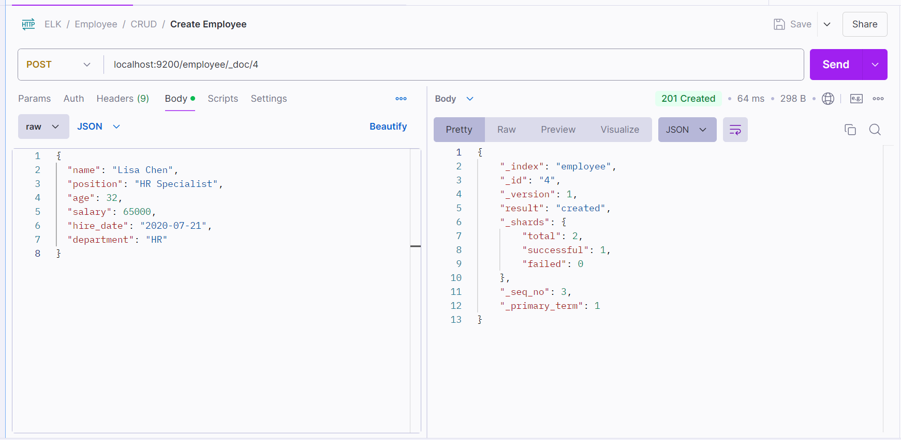
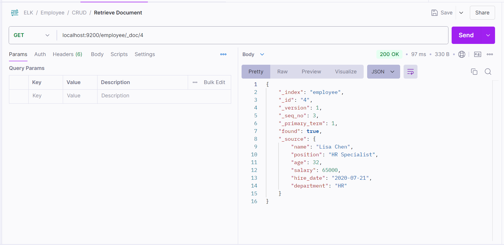
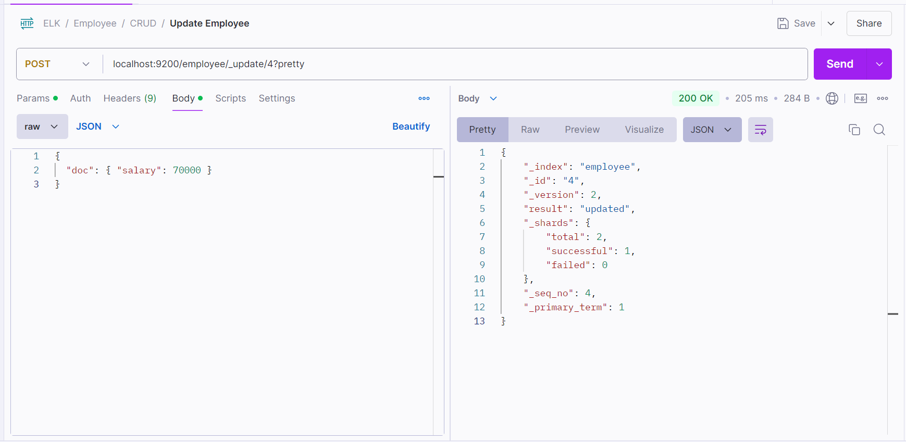
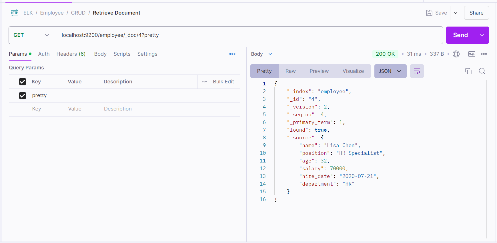
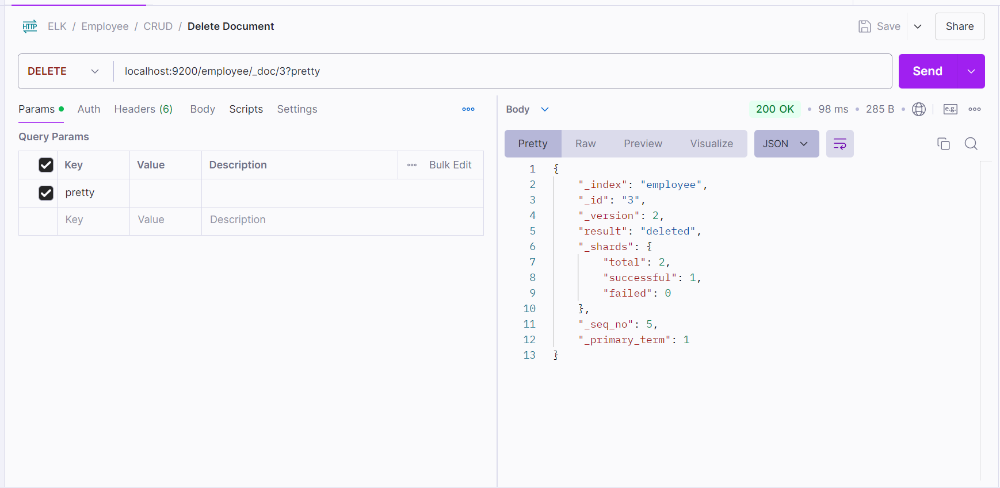
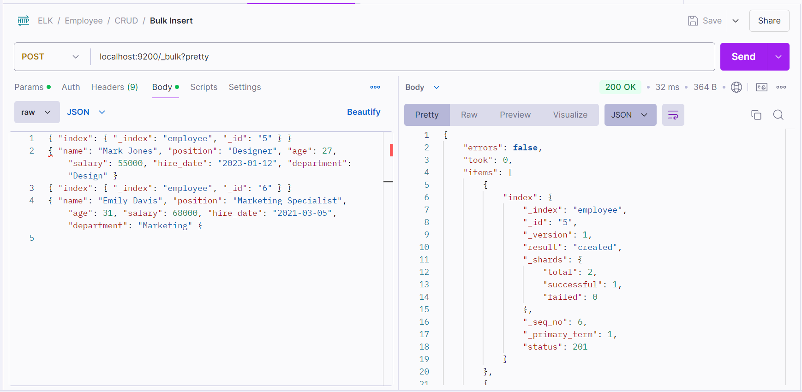

# Working with CRUD Operations in Elasticsearch

Here, we’ll cover how to manage data in Elasticsearch by performing CRUD operations: Create, Read, Update, and Delete. These are fundamental actions you'll use to work with documents in Elasticsearch. We’ll use our employee index as the example throughout.

## 1. CRUD Operations in Elasticsearch

Here’s a quick overview:

- **Create:** Add a new document to an index.
- **Read:** Retrieve documents based on IDs or search queries.
- **Update:** Modify specific fields in existing documents.
- **Delete:** Remove documents from an index.

## **`C` : Create Documents**

You’ve already added a few employee records to the `employee` index, so let’s add one more document to refresh:

- **Method**: `POST`
- **URL**: `http://localhost:9200/employee/_doc/4`
- **Body** (select `raw` and choose `JSON` format):

Click **Send**. You will get back the document as a JSON response.

```json
{
  "name": "Lisa Chen",
  "position": "HR Specialist",
  "age": 32,
  "salary": 65000,
  "hire_date": "2020-07-21",
  "department": "HR"
}
```

- Here, we use the `POST` request to add a new document to the `employee` index. `_doc/4` sets a unique ID (`4`) for this document.
- The data is specified in JSON format.
  You should get a response like this:

  ```json
  {
      "_index" : "employee",
      "_id" : "4",
      "_version" : 1,
      "result" : "created",
      ...
  }
  ```



## **`R` : Retrieve Documents**

### 1. **Retrieve by ID**

- You can get any document using its unique ID. For example, to retrieve Lisa’s record:
- **Method**: `GET`
- **URL**: `http://localhost:9200/employee/_doc/4?pretty`

Click **Send**. You will get back the document as a JSON response. You should see the JSON document you added earlier.



### 2. **Retrieve All Documents**

- To see all documents within the `employee` index, you can run a `_search` query:
- **Method**: `GET`
- **URL**: `http://localhost:9200/employee/_search/4?pretty`
- **Body** (select `raw` and choose `JSON` format):

Click **Send**. You will get back the document as a JSON response.

```json
{
  "query": { "match_all": {} }
}
```


- The `match_all` query returns every document in the index.

## **`U` : Update Document**

Let’s update Lisa Chen’s salary in her record. Elasticsearch provides two ways to update a document: **partial update** (only modifying specific fields) or **full replacement** (replacing the entire document). We’ll focus on partial updates.

### 1. **Partial Update**

- Use the `POST` request with `_update` to change Lisa’s salary:
- **Method**: `POST`
- **URL**: `http://localhost:9200/employee/_update/4?pretty`
- **Body** (select `raw` and choose `JSON` format):

Click **Send**. You will get back the document as a JSON response.

```json
{
  "doc": { "salary": 70000 }
}
```



- This command only updates the `salary` field, leaving all other fields unchanged.

### 2. **Verify the Update**

- Retrieve the document to confirm the salary update:
- **Method**: `GET`
- **URL**: `http://localhost:9200/employee/_doc/4?pretty`

Click **Send**. You will get back the document as a JSON response. You should see the JSON document you added earlier.



## **`D` : Delete a Document**

To delete a document, use the document ID with the DELETE request. Let’s delete Sam Lee’s record (ID 3):

- **Method**: `DELETE`
- **URL**: `http://localhost:9200/employee/_doc/3?pretty`

Click **Send**. You will get back the document as a JSON response.



- This command delete the Lee's record.

## Using Bulk Operations for Efficiency

Elasticsearch provides a **bulk API** that allows you to perform multiple operations (create, update, delete) in a single request. This method is particularly efficient for handling large data sets.

### Example of Bulk Insert

In this example, we’ll insert a few more employees using the bulk API.

- Use the `POST` request with `_bulk` to bulk insert:
- **Method**: `POST`
- **URL**: `http://localhost:9200/_bulk?pretty`
- **Body** (select `raw` and choose `JSON` format):

Click **Send**. You will get back the document as a JSON response.

```json
{ "index": { "_index": "employees", "_id": "5" } }
{ "name": "Mark Jones", "position": "Designer", "age": 27, "salary": 55000, "hire_date": "2023-01-12", "department": "Design" }
{ "index": { "_index": "employees", "_id": "6" } }
{ "name": "Emily Davis", "position": "Marketing Specialist", "age": 31, "salary": 68000, "hire_date": "2021-03-05", "department": "Marketing" }
```


