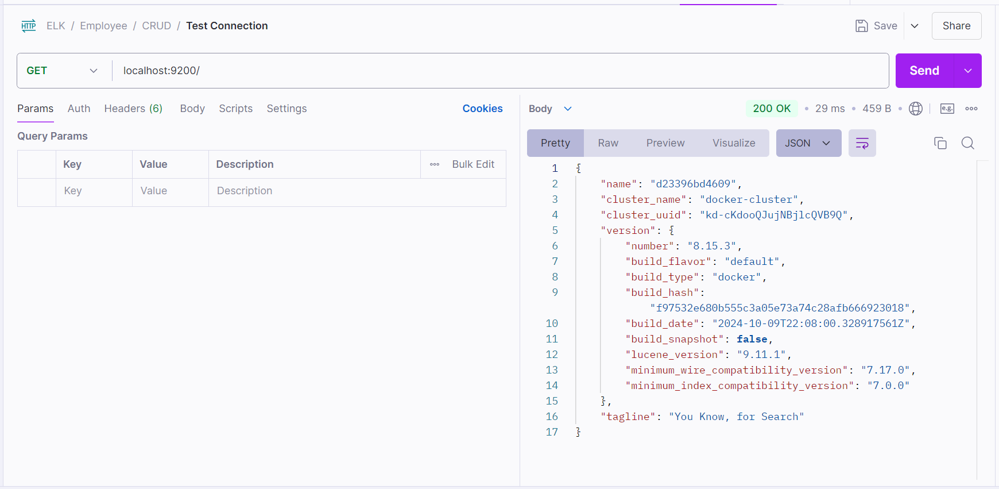
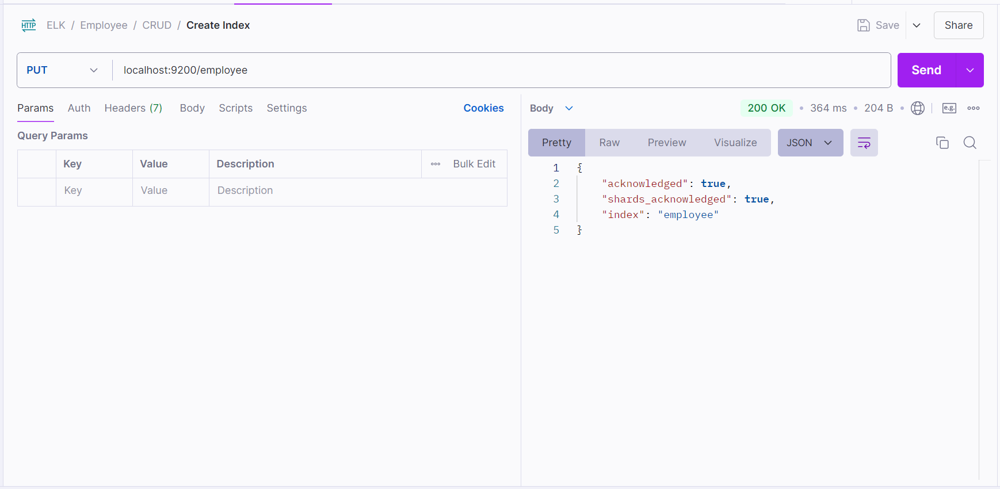
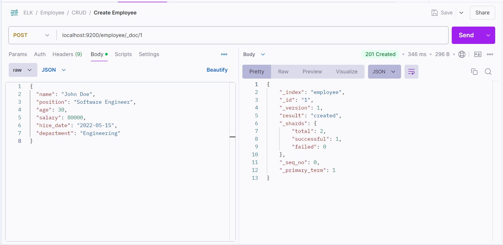
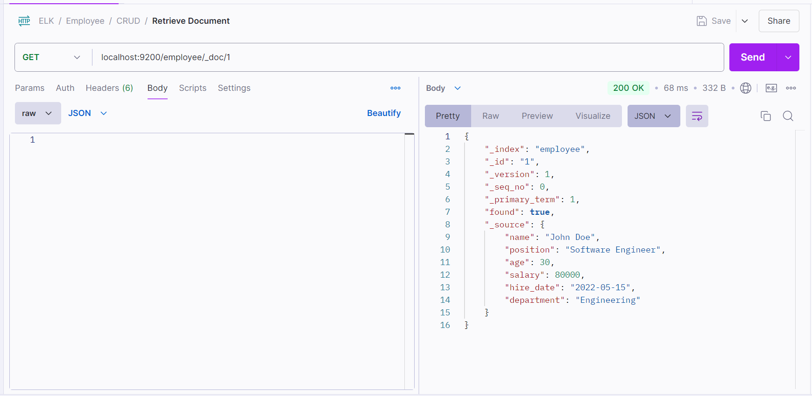

# Setting Up Postman to Talk to Elasticsearch

## Prerequisites

Make sure you have [Postman](https://www.postman.com/) installed and that your Elasticsearch instance is running on `http://localhost:9200`.

## Step 1: Test the Connection

1. **Open Postman**.
2. Create a new **GET** request with the following URL:

   ```
   http://localhost:9200/
   ```

3. Click **Send**. You should receive a response similar to the example below:

   ```json
   {
     "name": "your_node_name",
     "cluster_name": "elasticsearch",
     "version": {
       "number": "x.x.x",
       "lucene_version": "lucene_version"
     },
     "tagline": "You Know, for Search"
   }
   ```

   

## Step 2: Create an Index

Create an index called `employee`, follow the instructions below:

- **Method**: `PUT`
- **URL**: `http://localhost:9200/employee?pretty`

  - The `PUT` request creates the index named `employee`.
  - Adding `?pretty` formats the JSON response to make it more readable.

Click **Send**. This will create an index called `"employee"`.

If the index is created successfully, you should see a response like:

```json
{
  "acknowledged": true,
  "shards_acknowledged": true,
  "index": "employee"
}
```



## Step 3: Add a Document to the Index

Now, Let’s add an employee record (document) to the index `employee`.

- **Method**: `POST`
- **URL**: `http://localhost:9200/employee/_doc/1`
- **Body** (select `raw` and choose `JSON` format):

  ```json
  {
    "name": "John Doe",
    "position": "Software Engineer",
    "age": 30,
    "salary": 80000,
    "hire_date": "2022-05-15",
    "department": "Engineering"
  }
  ```

  

  - Here, we use the `POST` request to add a new document to the `employee` index. `_doc/1` sets a unique ID (`1`) for this document.
  - The data is specified in JSON format.
    You should get a response like this:

  ```json
  {
    "_index" : "employee",
    "_id" : "1",
    "_version" : 1,
    "result" : "created",
    ...
  }
  ```

Click **Send**. This will insert a document with the specified fields.

## Step 4: Retrieve the Document

To verify that the document was added successfully, retrieve it using the document ID (`1`):

- **Method**: `GET`
- **URL**: `http://localhost:9200/employee/_doc/1`

Click **Send**. You will get back the document as a JSON response.
You should see the JSON document you added earlier.

```json
{
  "_index": "employee",
  "_id": "1",
  "_version": 1,
  "_seq_no": 0,
  "_primary_term": 1,
  "found": true,
  "_source": {
    "name": "John Doe",
    "position": "Software Engineer",
    "age": 30,
    "salary": 80000,
    "hire_date": "2022-05-15",
    "department": "Engineering"
  }
}
```



## Step 5: Add More Documents

To see the power of Elasticsearch with multiple records, let’s add a few more employee documents. Run each `curl` command below to add these additional documents:

1. **Add Employee 2**

   ```json
   {
     "name": "Jane Smith",
     "position": "Product Manager",
     "age": 29,
     "salary": 90000,
     "hire_date": "2021-11-10",
     "department": "Product"
   }
   ```

2. **Add Employee 3**

   ```json
   {
     "name": "Sam Lee",
     "position": "Data Analyst",
     "age": 35,
     "salary": 70000,
     "hire_date": "2019-03-08",
     "department": "Data"
   }
   ```
