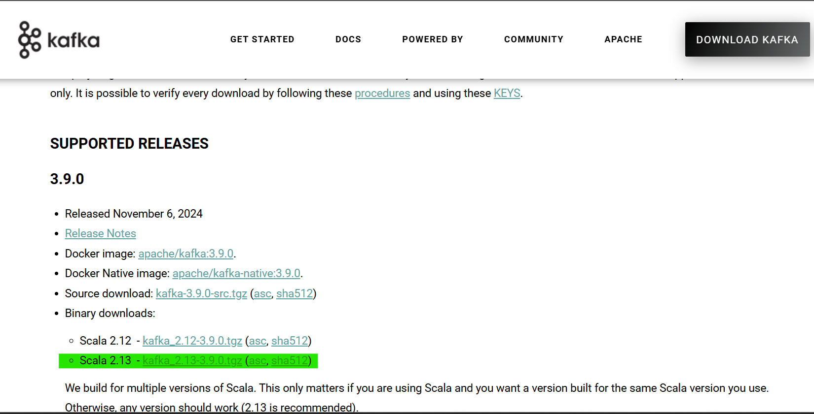
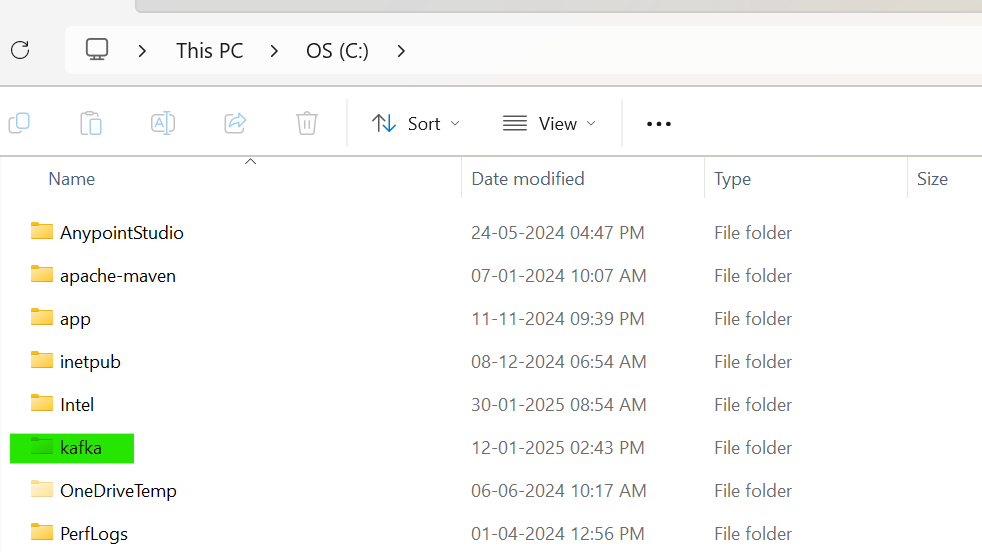

# Kafka Installation and Setup Guide on Windows

This guide provides step-by-step instructions to install and configure Apache Kafka on a Windows machine using the Command Line Interface (CLI) via CMD. Apache Kafka is a distributed streaming platform, and this setup uses the built-in ZooKeeper for coordination.

## Prerequisites

1. **Java Development Kit (JDK)**: Kafka requires Java 8 or higher.
2. **Apache Kafka Binary**: Download the Kafka binary distribution.
3. **Windows OS**: This guide is tested on Windows 10/11.

---

## Step 1: Check and Install Java JDK

Kafka runs on Java, so you need to verify if JDK is installed and install it if necessary.

1. **Check for Existing Java Installation**:
   - Open CMD:
     ```
     cmd
     ```
   - Check the Java version:
     ```
     java -version
     ```
   - If installed, you’ll see output like:
     ```
     java version "11.0.22" 2023-01-17 LTS
     ```
   - If you get `'java' is not recognized`, proceed to download install JDK.

---

## Step 2: Download and Extract Kafka

1. **Download Kafka**:

   - Go to the [Apache Kafka Downloads page](https://kafka.apache.org/downloads).
   - Download the latest binary (e.g., `kafka_2.13-3.9.0.tgz`).
     

2. **Extract Kafka**:

   - Use a tool like 7-Zip to extract `kafka_2.13-3.9.0.tgz` to `C:\kafka`.
   - Extract it and rename directory as `kafka` and place it in `C Drive`.
     

3. **Verify Extraction**:
   - Navigate and open the Kafka directory:
   - You should see directories like `bin`, `config`, and `libs`.
     

---

<!-- ## Step 3: Configure Kafka and ZooKeeper

1. **ZooKeeper Configuration**:

   - Open `C:\kafka\config\zookeeper.properties` in a text editor (e.g., Notepad).
   - Ensure `dataDir` is set:
     ```
     dataDir=C:/kafka/zookeeper-data
     ```
   - Create the directory:
     ```
     mkdir C:\kafka\zookeeper-data
     ```

2. **Kafka Server Configuration**:
   - Open `C:\kafka\config\server.properties` in a text editor.
   - Ensure `log.dirs` is set:
     ```
     log.dirs=C:/kafka/kafka-logs
     ```
   - Create the directory:
     ```
     mkdir C:\kafka\kafka-logs
     ```

**Screenshot**:

_Caption: Screenshot showing the created `zookeeper-data` and `kafka-logs` directories in File Explorer or CMD `dir` output._

--- -->

## Step 3: Start ZooKeeper

1. **Open a New CMD Window**:

   ```
   cmd
   ```

2. **Navigate to Kafka Directory**:

   ```
   cd C:\kafka
   ```

3. **Start ZooKeeper**:
   - Run:
     ```
     bin\windows\zookeeper-server-start.bat config\zookeeper.properties
     ```
   - Keep this window open to see ZooKeeper logs.

**Screenshot**:
  
_Caption: Screenshot showing ZooKeeper startup logs in CMD._

---

## Step 4: Start Kafka Server

1. **Open Another CMD Window**:

   ```
   cmd
   ```

2. **Navigate to Kafka Directory**:

   ```
   cd C:\kafka
   ```

3. **Start Kafka**:
   - Run:
     ```
     bin\windows\kafka-server-start.bat config\server.properties
     ```
   - Keep this window open to see Kafka logs.

**Screenshot**:
  
_Caption: Screenshot showing Kafka server startup logs in CMD._

---

## Step 5: Create a Kafka Topic

1. **Open a New CMD Window**:

2. **Navigate to Kafka Directory**:

   ```cmd
   cd C:\kafka
   ```

3. **Create a Topic**:

   - Create `test-topic`:
     ```
     bin\windows\kafka-topics.bat --create --topic test-topic --bootstrap-server localhost:9092 --partitions 1 --replication-factor 1
     ```
   - Output:
     ```
     Created topic test-topic.
     ```

4. **List Topics**:
   - Verify:
     ```
     bin\windows\kafka-topics.bat --list --bootstrap-server localhost:9092
     ```
   - Output:
     ```
     test-topic
     ```

**Screenshot**:
  
_Caption: Screenshot showing the output of topic creation and listing in CMD._

---

## Step 6: Test Kafka with Producer and Consumer

1. **Start a Producer**:

   - Open a new CMD window and navigate:
     ```
     cd C:\kafka
     ```
   - Run:
     ```
     bin\windows\kafka-console-producer.bat --topic test-topic --bootstrap-server localhost:9092
     ```
   - Type messages (e.g., `Hello Kafka`) and press Enter.

2. **Start a Consumer**:
   - Open another CMD window and navigate:
     ```
     cd C:\kafka
     ```
   - Run:
     ```
     bin\windows\kafka-console-consumer.bat --topic test-topic --from-beginning --bootstrap-server localhost:9092
     ```
   - See the messages from the producer.

**Screenshot**:
  
_Caption: Screenshot showing producer sending messages and consumer receiving them in separate CMD windows._

---

## Step 7: Stop Kafka and ZooKeeper

1. **Stop Kafka Server**:

   - Go to the Kafka server CMD window and press `Ctrl+C`.

2. **Stop ZooKeeper**:
   - Go to the ZooKeeper CMD window and press `Ctrl+C`.

**Screenshot**:
  
_Caption: Screenshot showing the Kafka and ZooKeeper CMD windows after pressing `Ctrl+C` with shutdown logs._

---

## Troubleshooting

- **Java not found**: Recheck `JAVA_HOME` and PATH.
- **Port conflicts**: Verify ports `9092` (Kafka) and `2181` (ZooKeeper):
  ```
  netstat -a -n -o | find "9092"
  netstat -a -n -o | find "2181"
  ```
- **Logs**: Inspect `C:\kafka\kafka-logs` and `zookeeper-data`.

---

## Notes

- This is a single-node setup for testing.
- Use quotes for paths with spaces in CMD.
