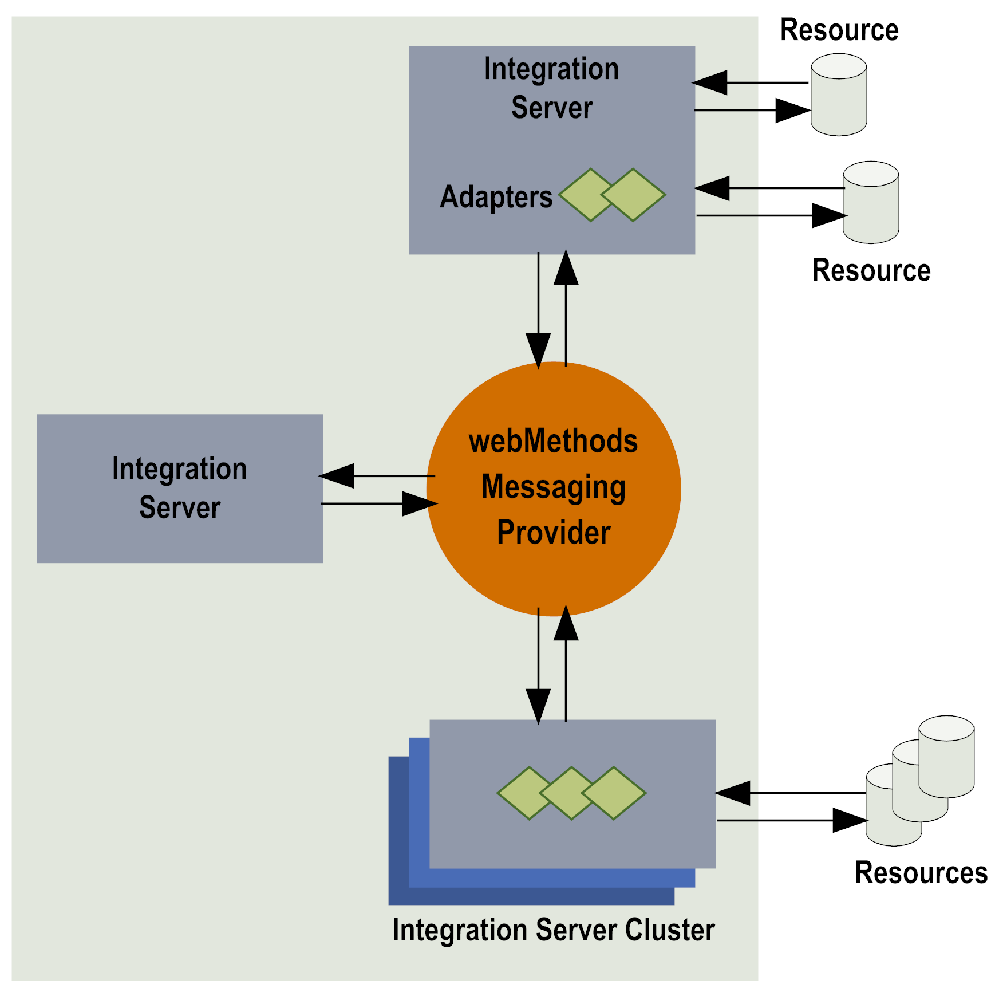

# webMethods Components in the Publish-Subscribe Model

## Overview

webMethods utilizes key components to implement the publish-subscribe (pub-sub) model. These components work together to enable fast and efficient document exchange across the system.

The primary components are:

1. **Integration Server**: The central engine for integration logic and message handling.
2. **Messaging Providers**: Intermediaries responsible for routing documents between publishers and subscribers.

---

## Components Explained

### 1. **Integration Server**

The **Integration Server** acts as the heart of the pub-sub solution.

- **What it Does**:

  - Serves as the entry point for systems and applications that need to be integrated.
  - Executes integration logic such as transforming, routing, or enriching data.
  - Publishes documents to, and receives documents from, the messaging providers.
  - Manages information processing both inside and outside the enterprise.

- **Real-Time Example**:  
   Imagine an e-commerce platform that integrates its inventory management and order processing systems using Integration Server.
  - **Scenario**: When a new order is placed, the Integration Server publishes an **order document** to the messaging provider.
  - The **inventory system** (subscriber) receives this document, updates stock levels, and processes the order.

---

### 2. **webMethods Messaging Providers**

Messaging providers act as intermediaries that handle message routing and delivery between publishers and subscribers. They enable both synchronous and asynchronous communication.

- **Core Responsibilities**:

  - Receiving, queuing, and delivering documents.
  - Supporting various messaging patterns, including:
    - **Publish-Subscribe**: Documents are sent to multiple subscribers.
    - **Request-Reply**: A document is sent, and a specific response is expected.
    - **Publish-and-Wait**: Publishers wait for acknowledgment or processing results.

- **Available Messaging Providers**:

  1.  **Universal Messaging**: A modern, scalable messaging provider.
  2.  **Broker**: An older messaging provider (now deprecated).

- **Real-Time Example**:  
   In a financial services application:
  - **Scenario**: A stock trading system publishes real-time stock price updates to a messaging provider.
  - **Subscribers**: Mobile apps and desktop platforms receive updates in real time, ensuring users can act on market changes promptly.

> **Note**: Since **webMethods Broker** is deprecated, Universal Messaging is recommended for all new implementations.

---

